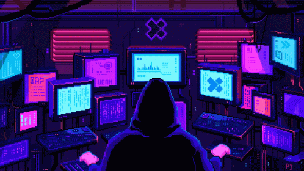
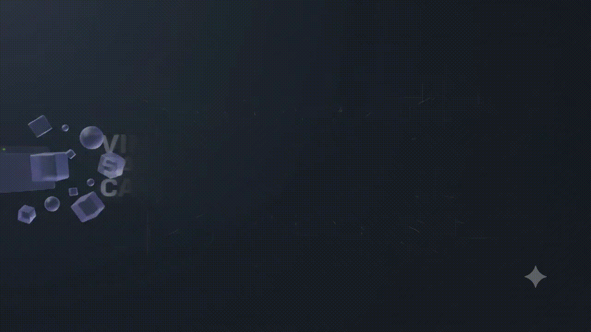

# 👨🏻‍💻 Vinicius Santos Camelo

### `Desenvolvedor Front-End em progresso 🚀`

---

## 🧑🏻‍💻 Sobre mim

 Estudante de **Desenvolvimento de Sistemas**
 Focado em **Front-End & Desenvolvimento Web**
 Gosto de criar **interfaces modernas e experiências interativas**
 Transformando estudos em projetos reais

> 💜 *Um projeto de cada vez. Uma habilidade de cada vez.*

## 🌐 Conecte-se comigo

---

## 🧰 Tecnologias

### Front-End

### Ferramentas

## Atualmente aprendendo

---

## 📊 GitHub

---

##  Objetivo

> **Construir, aprender e evoluir.**

Quero continuar desenvolvendo minhas habilidades, entrar na faculdade e conquistar meu espaço no mercado de tecnologia.

---

## 🟢 `status`

---

### 💜 Obrigado por visitar meu perfil

`Vinicius Santos Camelo`

### `Desenvolvedor Front-End em progresso 🚀`

